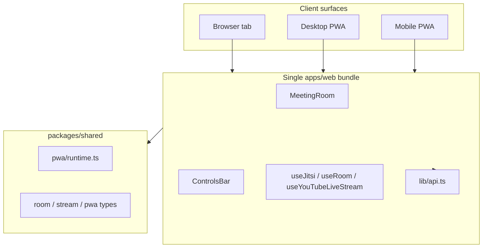

# PWA Architecture — Build Once, Work Everywhere

**Last updated:** 2026-06-23  
**Goal:** One web codebase serves the browser, desktop PWA, and mobile PWA. Functional meeting features must not fork by surface unless explicitly documented.

---

## Executive summary

Bold is a **single Next.js application** (`apps/web`). There is no separate native app, no mobile-only meeting bundle, and no desktop Electron shell.

| Surface | What it is | How it runs |
|--------|------------|-------------|
| **Browser** | Tab visit to `bold.robozant.com` | Standard HTTPS + optional service worker |
| **Desktop PWA** | Installed from Chrome/Edge “Install app” | Same origin, `display: standalone`, `start_url: /join` |
| **Mobile PWA** | iOS “Add to Home Screen” or Android install prompt | Same origin, standalone display, safe-area insets |

Installing the PWA **does not change routes or components**. It changes display mode, optional install/update UX, and platform capabilities (e.g. screen share).



---

## Shared code paths (single source of truth)

### Meeting experience

All authenticated and guest meetings render the **same** `MeetingRoom` component:

| Entry route | Gate / wrapper | Meeting UI |
|-------------|----------------|------------|
| `/meeting/[code]/room` | Server auth + `MeetingRoom` | `MeetingRoom` |
| Guest with token | `GuestRoomGate` | `MeetingRoom` |
| Post-lobby join | Lobby → redirect to room | `MeetingRoom` |

**Shared meeting modules** (do not duplicate for PWA):

| Concern | Location |
|---------|----------|
| Room shell | `components/meeting/MeetingRoom.tsx` |
| Controls | `components/meeting/ControlsBar.tsx` |
| Chat | `components/meeting/ChatPanel.tsx` |
| Participants | `components/meeting/ParticipantsPanel.tsx` |
| Layout / dock | `hooks/useMeetingLayout.ts`, `components/meeting/ParticipantDock.tsx` |
| Media (Jitsi) | `hooks/useJitsi.ts`, `lib/media/jitsi-provider.ts` |
| YouTube Live | `hooks/useYouTubeLiveStream.ts`, `components/meeting/YouTubeLive*.tsx` |
| Room / webinar state | `hooks/useRoom.ts`, `stores/roomStore.ts` |
| Realtime | `hooks/useSocket.ts` |
| API client | `lib/api.ts` |
| Shared types & limits | `packages/shared` |

### API & business logic

- **Web client:** `apps/web/src/lib/api.ts`
- **Server:** `apps/api` (NestJS) — same endpoints for browser and PWA
- **Shared contracts:** `packages/shared` (room modes, stream types, PWA analytics events, plan limits)

### Styling & responsive behavior

Meeting UI uses **one component tree** with Tailwind breakpoints and CSS variables (`globals.css`):

- `--meeting-bg`, `--meeting-controls-offset`, `meeting-controls-float`, `meeting-glass-panel`
- `env(safe-area-inset-*)` for notched phones (browser and PWA)

Responsive differences (e.g. chat panel full-screen on narrow viewports) are **CSS layout**, not separate apps.

### Runtime detection (consolidated)

Platform detection lives in **`packages/shared/src/pwa/runtime.ts`**:

| Function | Purpose |
|----------|---------|
| `isPwaStandalone()` | Installed PWA / iOS home screen |
| `isMobileEnvironment()` | Mobile UA or coarse pointer + narrow viewport |
| `isCoarsePointerMobileViewport()` | Touch-first layout breakpoint |
| `getRuntimeSurface()` | `browser-desktop` \| `browser-mobile` \| `pwa-desktop` \| `pwa-mobile` |

**Consumers** (import from `@boldmeet/shared`, not reimplemented):

- `lib/media/screen-share-capability.ts`
- `lib/media/meeting-controls-diagnostics.ts`
- `hooks/usePwaInstall.ts` (re-exports `isPwaStandalone` for backwards compatibility)
- `lib/stream-live-ui.ts`

---

## PWA-specific code

These files exist **only** because the app can be installed or updated as a PWA. They must **not** contain meeting business logic forks.

| Area | Files | Role |
|------|-------|------|
| Manifest | `public/manifest.webmanifest` | `standalone`, icons, `start_url: /join` |
| Service worker | `public/sw.js` | Controlled update lifecycle |
| Install UX | `components/pwa/PwaInstallBanner.tsx`, `IosInstallGuide.tsx`, `AndroidInstallGuide.tsx` | Prompt / manual install steps |
| Install hook | `hooks/usePwaInstall.ts` | `beforeinstallprompt`, analytics |
| Join hub | `components/pwa/PwaJoinHome.tsx`, `app/join/page.tsx`, `app/home/page.tsx` | PWA `start_url` entry |
| Pending join | `lib/pwa-pending-join.ts` | Resume join after install |
| Updates | `components/pwa/PwaUpdateManager.tsx`, `lib/pwa-update.ts`, `stores/pwaUpdateStore.ts` | SW registration, toast/banner/force update |
| Analytics | `apps/api/src/pwa/*`, `packages/shared/src/pwa/types.ts` | Install/open tracking |

**Rule:** PWA modules may **gate install/update UI** and **persist join intent**. They must call the same join/room flows as the browser.

---

## Mobile-specific code

“Mobile” here means **viewport + UA**, not a separate build. Mobile browser and mobile PWA share the same code path.

| Behavior | Implementation | Browser mobile | Mobile PWA |
|----------|----------------|----------------|------------|
| Screen share blocked | `detectScreenShareCapability()` | Disabled (OS/API) | Disabled (same message; Android PWA gets app-specific copy) |
| Controls auto-hide | `useMeetingControlsAutoHide.ts` | Mobile viewport only | Same |
| Controls reveal on return | `useMeetingPageLifecycle.ts` | Yes | Yes (critical for PWA backgrounding) |
| Chat / participants panel | `meeting-panel-mobile` + `sm:` breakpoints | Full-screen overlay | Same |
| More menu | Portal + `computeMoreMenuPosition.ts` | Safe-area aware | Same |
| Share screen button | `ControlsBar` + `shareUnavailable` | Shown, blocked with hint | Same |
| Floating participant dock | `ParticipantDock.tsx` | Hidden &lt; 768px | Hidden (same breakpoint) |
| YouTube watch auto-open tab | `shouldAutoOpenYoutubeWatchTab()` | Off on mobile UA | Off in standalone PWA |

**Documented platform limits** (not Bold forks): iOS/Android do not expose desktop-style `getDisplayMedia` for screen share. Behavior is gated in **one** capability module with user-facing copy.

---

## Desktop-specific code

“Desktop” = not `isMobileEnvironment()` unless noted.

| Behavior | Implementation | Notes |
|----------|----------------|-------|
| YouTube watch tab auto-open | `lib/stream-live-ui.ts` | Desktop **browser only**; skipped for mobile UA and any standalone PWA |
| Floating participant dock drag | `ParticipantDock.tsx` | `min-width: 768px` |
| Mouse-driven control reveal | `useMeetingControlsAutoHide.ts` | `mousemove` on non-mobile viewport |
| PWA install banner | `PwaInstallBanner.tsx` | Shown on dashboard; optional on join |

Desktop **PWA** uses the same meeting UI as desktop browser. Only install/update/analytics differ.

---

## Audit: code paths that differ by surface

| Feature | Browser | Desktop PWA | Mobile PWA | Shared component? |
|---------|---------|-------------|------------|-------------------|
| Meeting A/V | Jitsi iframe | Same | Same | Yes — `useJitsi` |
| Mute / camera / chat | `ControlsBar` | Same | Same | Yes |
| YouTube Live | `useYouTubeLiveStream` | Same | Same | Yes |
| Webinar / stage | `useRoom` | Same | Same | Yes |
| Screen share | Capability gate | Blocked on Android PWA copy | Blocked | Same `ControlsBar`, different `reason` string |
| Join flow UI | `/join`, lobby | `/join` + pending join restore | Same + iOS/Android install guides | `MeetingJoinGate` / lobby → same room |
| App updates | Optional SW | Toast / meeting banner | Same | `PwaUpdateManager` only |
| Layout panels | Responsive CSS | Same | Same | Yes |

### No duplicate meeting implementations found

Previous risk areas are **already unified**:

- One `MeetingRoom` (not `MobileMeetingRoom`)
- One `ControlsBar` (not separate PWA toolbar)
- One API client

### Remaining duplication removed (this audit)

- PWA/mobile UA detection consolidated into `packages/shared/src/pwa/runtime.ts`
- `screen-share-capability.ts` and `meeting-controls-diagnostics.ts` now import shared runtime helpers

### Acceptable responsive-only forks (keep as CSS / breakpoints)

- `ChatPanel` / `ParticipantsPanel`: `fixed inset-0` on small screens, anchored panel on `sm+`
- `globals.css` dock padding: narrower side dock on `max-width: 767px`

Do **not** add `if (isPwa)` branches inside meeting features unless the capability is inherently install-related (updates, install prompt).

---

## Join & routing map

```
/join              → PwaJoinHome (install-friendly hub)
/join/[code]       → MeetingJoinGate → lobby or room
/meeting/[code]    → MeetingLobby (preview)
/meeting/[code]/room → MeetingRoom
/home              → redirects to /join (manifest start_url companion)
```

PWA `start_url` is `/join`. After install, users hit the **same** join hub as browser users.

---

## Service worker & caching

- **Registration:** `PwaUpdateManager` via `ClientProviders` (global)
- **Strategy:** Update-focused (`sw.js`); not a separate offline meeting client
- **In meeting:** non-blocking update banner (`PwaUpdateMeetingBanner`); force modal only when required

Meeting media does **not** run in the service worker. SW must never cache authenticated API responses for meeting state.

---

## Testing matrix

Any new **meeting** feature must be verified on:

| # | Surface | How to test |
|---|---------|-------------|
| 1 | Desktop browser | Chrome/Edge, normal tab |
| 2 | Desktop PWA | Installed app from same origin |
| 3 | Mobile browser | Safari iOS / Chrome Android |
| 4 | Mobile PWA | Add to Home Screen / installed APK-style icon |

**Minimum meeting smoke:** join → mic/camera → chat → participants → leave. Host: share screen (desktop only), YouTube Live (if applicable), webinar promote (if applicable).

Related QA docs:

- `docs/MOBILE_PWA_STABILITY_AUDIT.md`
- `docs/MOBILE_PWA_MEETING_CONTROLS_DIAGNOSTIC.md`

Dev-only: `/dev/pwa-audit` (404 in production).

---

## Future development rules

### 1. Build once, work everywhere

> **Any new meeting feature must be tested and supported in browser, desktop PWA, and mobile PWA — unless explicitly documented otherwise.**

“Documented otherwise” means:

- A **platform limitation** (e.g. OS denies screen capture on iOS) with a single capability gate and shared UI showing the blocked state
- A **non-meeting** feature scoped to install/update only

Add exceptions to the table in **Audit: code paths that differ** above.

### 2. Where to put new code

| If you are building… | Put it in… |
|---------------------|------------|
| Meeting UI or behavior | `components/meeting/*`, `hooks/use*.ts` |
| API call | `lib/api.ts` + `apps/api` |
| Cross-client types / limits | `packages/shared` |
| PWA install or update only | `components/pwa/*`, `lib/pwa-*.ts` |
| Runtime browser/PWA/mobile detection | `packages/shared/src/pwa/runtime.ts` |

### 3. Do not

- Create `MeetingRoomMobile`, `PwaControlsBar`, or parallel API clients
- Branch meeting logic on `isPwaStandalone()` except for analytics or install/update UX
- Copy-paste UA regexes — use `@boldmeet/shared` `pwa/runtime` and `pwa/browser`
- Hide meeting features behind `display-mode: standalone` without a documented OS limitation

### 4. Do

- Use responsive Tailwind (`sm:`, `md:`) and `meeting-panel-mobile` patterns for layout
- Use `detectScreenShareCapability()` before enabling share
- Use `useMeetingPageLifecycle` when adding UI that must recover after backgrounding
- Gate dev diagnostics with `isDevEnvironment()` (never expose in production UI)
- Update this document when adding a **documented exception**

### 5. PR checklist (meeting changes)

- [ ] Uses shared `MeetingRoom` / hooks (no forked surface)
- [ ] Tested desktop browser + desktop PWA
- [ ] Tested mobile browser + mobile PWA (or noted OS limitation)
- [ ] No new duplicated platform detection
- [ ] Exception documented in this file if behavior intentionally differs

---

## Related files (quick index)

```
apps/web/
  public/manifest.webmanifest
  public/sw.js
  src/components/meeting/          # All meeting UI
  src/components/pwa/              # Install & update only
  src/hooks/useJitsi.ts
  src/hooks/useMeetingPageLifecycle.ts
  src/lib/media/screen-share-capability.ts
  src/lib/pwa-pending-join.ts
  src/lib/pwa-update.ts

packages/shared/src/pwa/
  runtime.ts                       # Platform detection SSOT
  browser.ts
  types.ts
```

---

## Changelog

| Date | Change |
|------|--------|
| 2026-06-23 | Initial architecture audit; consolidated `pwa/runtime.ts`; documented surfaces and dev rules |
